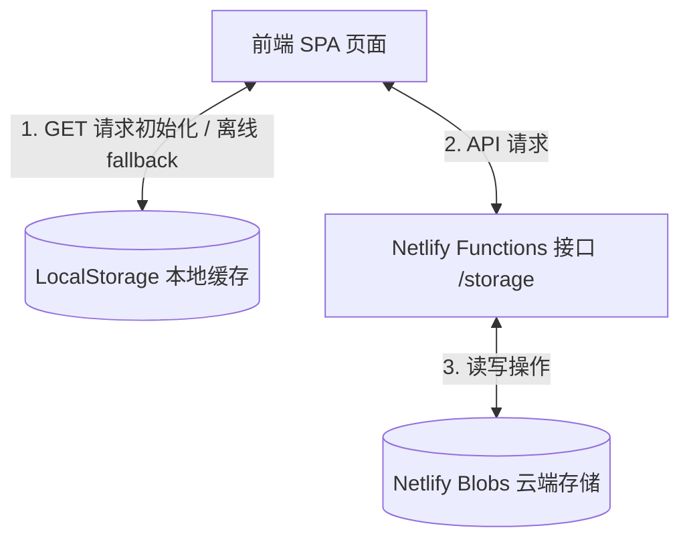

# 宝可梦主题随机奖励抽签系统 - 产品需求文档 (PRD) 与技术规范 (Spec)

---

## 1. 项目概述

### 1.1 背景与目标
为了激励孩子完成日常任务（如做家务、写作业、早睡等），家长设置一些随机奖励以增加趣味性和期待感。本项目开发了一款高颜值、流畅交互的**宝可梦主题的随机奖励抽签小游戏**（单页网页应用 SPA）。
为了彻底解决“更换设备、清除浏览器缓存导致数据丢失”的问题，系统已由纯前端 LocalStorage 本地存储升级为 **Netlify Blobs 云端数据同步架构**，并全面优化了移动端闪烁、卡顿等操作细节。

### 1.2 目标用户与角色
*   **孩子（玩家）**：核心互动角色。掷精灵球并查看 3D 卡牌开奖，浏览抽中过的奖券列表。
*   **家长（系统管理员）**：奖励池的配置者与核销人。配置具体奖励、调配抽奖星级概率、核销奖券。受家长身份验证密码锁（PIN）保护。

---

## 2. 系统核心架构与同步机制

系统采用 **“Netlify Blobs 云端主存 + LocalStorage 本地缓存及离线兜底”** 的多端同步与双写架构。



### 2.1 初始化与拉取机制 (GET)
当页面加载时，执行 `initData()`：
1. 客户端向服务器 `GET /.netlify/functions/storage` 发送请求。
2. **在线状态**：拉取云端完整的 `{ pin, rewards, records, weights }` 数据，更新本地缓存（LocalStorage）与运行变量，重绘 UI。
3. **离线状态**：若网络请求超时或失败，自动降级读取本地 LocalStorage，提示“离线状态（Offline）”，确保在断网或局域网中能无缝使用。

### 2.2 数据同步与安全鉴权 (POST)
凡是对全局变量（奖励池、中奖历史、概率权重、密码）的写操作，均触发 **“双写”**：本地同步更新缓存，并异步向 `POST /.netlify/functions/storage` 推送最新状态。
*   **鉴权保护**：修改密码（`change_pin`）、核销记录（`redeem_records`）、修改奖池（`save_rewards`）及修改概率（`save_weights`）等敏感操作，必须在载荷中附加最新家长 PIN 码；云端在校验一致后才允许持久化覆写。
*   **孩子端免密**：孩子点击抽奖产生的“新增中奖记录”（`add_record`）操作为免密写入。服务端采用“首部追加（Prepend）”的形式将新数据并入 records 数组，可有效规避多设备并发抽奖时旧记录被覆盖的问题。

---

## 3. 核心功能需求与交互细节

### 3.1 抽签召唤系统（孩子端）
*   **精灵球 3D 召唤台**：点击抽奖，精灵球开始振幅递增的剧烈抖动与红光呼吸闪烁，2.8 秒后播放精灵球弹开并放射强光动画。
*   **TCG 卡牌翻转展示**：
    *   精灵球爆裂后飞出 3D Holographic（彩虹激光偏光效果）宝可梦 TCG 卡牌。
    *   卡牌展示该宝可梦高清官方原画、对应的奖励文本、该宝可梦的专属鼓励中文对话。
    *   弹出时全屏燃放彩色 Canvas 碎纸屑烟花。
*   **连抽防残留缓存优化**：
    *   在显示新结果弹窗前，立即解绑上一张图片的 `onload`/`onerror` 回调，将图片的 `src` 重置为 `1x1` 的透明 Base64 GIF 并隐藏，同时开启 Loading 指示器。
    *   在弹窗关闭淡出时，使用 `setTimeout` 延迟 `300ms`（等待淡隐动画结束）后彻底清空并隐藏图片 `src`，彻底防止连抽时短暂闪过上一只宝可梦图片的“鬼影闪烁”现象。

### 3.2 荣誉记录与核销系统（家长/孩子端）
*   **中奖荣誉榜**：列表按时间降序排列展示所有中奖未兑换的卡券。
*   **批量勾选核销与安全过滤**：
    *   列表每项左侧带复选框。勾选后，底部浮现“核销选中(X)”按钮，点击要求输入家长密码。
    *   **类型无关的安全核销机制**：在前端过滤与同步匹配中，将勾选的复选框 `value` 和记录中的 `record.id` 全部强制转换为 `String` 进行比对过滤。这彻底解决了部分由 `Math.random()` 浮点数生成的历史遗留 ID，因 `parseInt` 截断丢失精度，或 `String` 与 `Number` 严格相等比对失败所导致的“核销完毕后奖券重新露出来（无法真正删除）”的漏洞。
    *   在核销请求成功并返回最新状态后，强行触发列表重绘以同步服务器返回的数据。

### 3.3 开发者控制台与概率设置（家长端）
*   **入口保护**：点击右上角锁头图标，验证家长 PIN 码（默认 `1234`）通过后方能进入。提供圆润的大数字输入软键盘（PIN Keypad）方便在移动端输入，同时支持物理键盘直接按键录入。
*   **概率设置 Tab**：
    *   将旧版繁琐的手动同步 Tab 替换为直观的 **“抽签概率配置”** 滑块表单。
    *   支持为 `1星级` 到 `5星级` 的宝可梦奖励配置独立的滑块（Slider）和数字输入框（支持双向联动）。
    *   界面上会根据各星级当前权重占比计算并实时呈现精确到小数点后一位的百分比概率（如 `1星级: 40.0%`）。
    *   抽奖逻辑内部采用基于当前配置权重的轮盘随机算法（`getWeightedRandomReward()`）。
*   **奖池编辑 Tab**：
    *   支持家长以可视化的行编辑器自由编辑每一项奖励的名称、所属星级与对应的宝可梦，具有自动保存和“重置为默认奖池”的一键兜底功能。

---

## 4. 移动端与性能优化专项 (Premium UX)

为保证在手机、平板等移动设备上的“秒开”与丝滑体验，系统集成了以下多项前端底层优化：

### 4.1 智能静默预加载 (Preload)
*   **机制**：在页面初始化获取数据成功后，以及每次家长点击“保存并生效奖励池”后，JS 会在后台静默发起对当前奖池中所有宝可梦的**高清原画卡面图**与**微缩头像图**的异步请求并自动载入浏览器缓存。
*   **效果**：当孩子掷出精灵球开奖时，对应宝可梦图已在本地磁盘/内存缓存中，无需等待下载转圈，实现 **0ms 秒开**。

### 4.2 多重 CDN 线路降级机制
*   **机制**：由于单一 CDN 镜像源在国内部分移动运营商网络下有偶尔卡死的可能，图片加载函数内置了多重降级域名列表：
    `Gcore CDN` $\rightarrow$ `JsDelivr 主干` $\rightarrow$ `Fastly 镜像` $\rightarrow$ `GitHub Raw 原始地址` $\rightarrow$ `本地 SVG (兜底)`
*   **效果**：若前置线路加载失败，控制台会抛出 Warn 并在 `.onerror` 中迅速切换到备份线路继续尝试加载。若全部 CDN 卡死，则以 inline Base64 渲染一个拟真的精灵球图案作为终极兜底，100% 保证程序在任何极端网络下不会因报错卡死或无限转圈。

### 4.3 渲染流畅度与排版细节
*   **点击高亮与防闪烁**：全局声明 `-webkit-tap-highlight-color: transparent;`，消除了安卓/iOS 浏览器在频繁点按精灵球与按钮时的灰色半透明遮罩闪烁层。
*   **GPU 硬件加速与防抖**：为精灵球等进行剧烈 3D/旋转动画的元素强制指定 `will-change: transform; backface-visibility: hidden; transform: translate3d(0, 0, 0);`。这在页面启动时即提示浏览器分配 GPU 渲染专层，解决了动画启动瞬间由于重绘可能引起的瞬时白屏或帧率抖动。
*   **按钮防溢出排版**：针对移动端窄屏，对主按钮 Padding 与字号进行了响应式收缩调整，并将溢出文本设置为自动折行或等宽布局。

---

## 5. 数据模型设计 (Data Schema)

### 5.1 奖池单项模型 (Reward Schema)
```typescript
interface RewardPoolItem {
    id: number;          // 唯一序号 (如 1, 2, 3...)
    text: string;        // 奖励内容描述
    star: number;        // 星级级别 (1-5 星)
    pokemonId: number;   // 绑定的宝可梦 ID (1-151)
    pokemonName: string; // 绑定的宝可梦中文名称
}
```

### 5.2 抽中记录模型 (Record Schema)
```typescript
interface DrawRecord {
    id: number | string; // 唯一 ID (新记录为 Date.now() 时间戳，老记录为带有 Math.random() 浮点数，采用 String 匹配)
    time: string;        // 格式化时间字符串 "YYYY年MM月DD日 HH:mm"
    reward: string;      // 获得的奖励描述文本
    pokemonId: number;   // 关联的宝可梦 ID
    pokemonName: string; // 关联的宝可梦中文名称
    star: number;        // 关联的星级等级
}
```

### 5.3 概率权重字典 (Weights Schema)
```typescript
interface StarWeights {
    [starKey: string]: number; // Key 为 "1", "2", "3", "4", "5"；Value 为权重值（默认 { "1": 40, "2": 30, "3": 20, "4": 10, "5": 5 }）
}
```

---

## 6. 本地开发调试方法

在本地进行无云开发调试时：
1. 运行 `node scratch/dev-server.js`，该脚本会在本地 `http://localhost:8888` 启动一个全真模拟服务器。
2. 模拟服务器会在本地 `scratch/blobs_mock.json` 自动维护一份隔离的本地 JSON 数据库，模拟 Netlify Blobs 的一切行为（包含数据双写与密码校验）。
3. 本地调试成功后，只需向 Git 远程仓库提交更新并推送到 Netlify。其底层 Blobs 云存储服务将完美兼容前端的最新变更。
