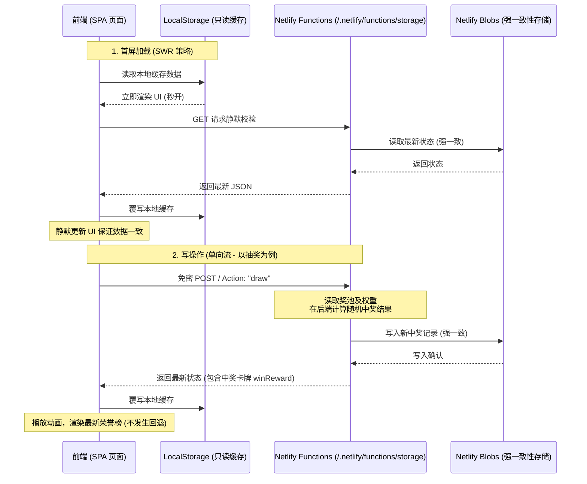

# 宝可梦主题随机奖励抽签系统 - 产品需求文档 (PRD) 与技术规范 (Spec)

---

## 1. 项目概述

### 1.1 背景与目标
为了激励孩子完成日常任务（如做家务、写作业、早睡等），家长设置一些随机奖励以增加趣味性和期待感。本项目开发了一款高颜值、流畅交互的**宝可梦主题的随机奖励抽签小游戏**（单页网页应用 SPA）。

为彻底解决“多设备并发、清除浏览器缓存导致数据丢失”的问题，系统已由纯前端本地存储升级为 **Netlify Blobs 云端数据同步架构**。在此基础上，系统通过强一致性模式改造、SWR 只读本地缓存、单向数据流与后端抽奖等重构，达成了数据零丢失、数据不回退以及多端绝对强一致的数据体系。

### 1.2 目标用户与角色
*   **孩子（玩家）**：核心互动角色。掷精灵球并查看由 3D Holographic 卡牌展示的开奖结果，在右侧浏览已抽中的奖券。点击奖券可随时查看卡片详情。
*   **家长（系统管理员）**：奖励池的配置者、奖券补发者与核销人。配置奖池、调配抽奖星级概率、核销奖券。受家长身份验证密码锁（PIN）保护。

---

## 2. 系统核心架构与同步机制

系统采用 **“Netlify Blobs 强一致性云端存储为主存 + LocalStorage 本地只读缓存”** 的单向数据流控制模型。



### 2.1 强一致性读写模式 (Consistency: Strong)
为避免在多设备连续操作或高频刷新页面时出现“旧数据覆盖新数据”、“核销后再次刷出”的最终一致性同步回滚，系统将 Netlify Blobs 存储实例化方式改造为 **强一致性模式（Strong Consistency）**：
```javascript
const store = getStore({
    name: "pokemon-luckydraw-store",
    consistency: "strong"
});
```
这保证了云端写入会立即可见，所有的读写请求均绕过边缘节点的旧缓存，彻底杜绝数据在多端不一致的问题。

### 2.2 SWR (Stale-While-Revalidate) 缓存与初始化
当页面加载时，执行 `initData()`：
1. **优先读取本地**：无延迟从 LocalStorage 中读取数据并进行首屏渲染，保证秒开体验。
2. **后台静默校验**：在后台异步向云端接口发送 `GET` 请求获取权威最新的云端状态。
3. **静默覆盖**：当云端响应成功后，用最新的数据覆写本地 LocalStorage，并静默重绘 UI，消除可能存在的缓存偏置；如网络连接失败，则无缝切换至离线缓存模式。

### 2.3 单向数据流与写入控制
前端取消了任何“本地先行修改数据并提示同步中”的双向写操作。前端在遇到以下写操作（抽奖、批量核销、手动补发、保存奖池、保存权重、修改密码）时：
* 所有的修改指令和新状态一律先通过 API 请求提交给云端。
* 只有当云端接口返回 `status: 200` 并且携带了权威的最新的云端完整数据时，前端才使用返回体覆写 `localStorage`，然后重绘 UI 状态。
* 若接口写入失败，则保留本地界面的原本状态并弹出弹窗报错，绝对不将脏数据存入本地缓存，保障数据链条的绝对可靠。

---

## 3. 核心功能需求与交互细节

### 3.1 抽签召唤系统（孩子端）
*   **服务器端强安全抽奖**：抽奖随机算法完全移至后端云函数执行。前端点击抽奖时，发送免密 POST 请求 `action: "draw"`。后端云函数读取云端奖池和概率权重，执行基于轮盘概率的随机算法，生成对应的时间（强制格式化为东八区北京时间）和记录 ID，并将生成的中奖记录安全落库，最后将中奖详情 `winReward` 随同最新数据一次性返回给前端。这彻底杜绝了前端篡改随机数作弊的可能。
*   **精灵球 3D 召唤台**：点击抽奖，精灵球开始振幅递增的剧烈抖动与红光呼吸闪烁，2.4秒后精灵球开始裂开播放强光动画。
*   **TCG 卡牌翻转展示**：
    *   2.8秒后，飞出 3D Holographic 彩虹偏光宝可梦 TCG 卡牌。
    *   卡牌展示该宝可梦的高清官方原画、对应的奖励文本、该宝可梦的专属招牌对话描述。
    *   弹出时全屏燃放彩色 Canvas 碎纸屑烟花。
*   **卡牌按钮动态文字**：在抽奖中奖时，卡牌下方的控制按钮文字为 **“太棒了，收入背包！”**；而在右侧荣誉榜查阅已得卡券时，该按钮会动态切换为普通的 **“关闭”**。

### 3.2 中奖荣誉榜查阅与勾选核销（家长/孩子端）
*   **点击奖券查看大图**：现在荣誉榜中的奖券行支持直接点击。点击后即可弹窗展示该奖券对应的精美 3D Holographic 宝可梦卡牌，且底部的控制按钮自动变为“关闭”。
*   **勾选防冲突机制**：只有点击奖券行最左侧的复选框 (Checkbox) 时才是勾选动作。勾选区配有冒泡截断 (`event.stopPropagation()`)，绝对不会因为勾选时误触发卡牌的弹窗，同时也不会因为点击奖券行导致误勾选。
*   **批量勾选核销**：勾选后输入家长密码，前端发送 `action: "redeem_records"` 将核销后的记录列表同步给云端，成功后重绘荣誉榜。

### 3.3 开发者后台与中奖记录管理（家长端）
*   **入口保护**：点击右上角锁头图标，验证家长密码后进入。
*   **中奖记录管理 Tab [新增]**：
    *   **手动补发中奖奖券**：家长可以下拉直接克隆奖池中已有的奖励，系统将自动联动填充其对应的星级和绑定宝可梦；亦可完全手动输入新的奖项。指定好绑定的宝可梦与星级后，点击“确认补发”即可免去孩子掷球动作，直接向荣誉榜最前端追加一条中奖记录（时间自动通过工具函数计算生成为东八区北京时间），强一致性同步云端。
    *   **单条记录管理列表**：以列表形式展示所有当前荣誉榜中的记录。家长点击右侧的垃圾桶图标即可在确认后**单条独立核销或删除**任何指定的卡券，强一致性同步云端。
*   **奖池编辑 Tab 与 JSON 导入**：
    *   **导入配置按钮 [新增]**：奖励池底栏新增“导入配置”按钮，允许上传本地的 `.json` 配置文件。前端对其进行格式安全性检查，并在导入后暂时作为草稿更新到编辑器行列表中。
    *   **二次确认保护与草稿缓冲**：导入后不会立刻冲掉云端奖池，需确认无误后点击“保存并生效”按钮才真正保存写入。
    *   **宝可梦专属话术联动填充**：在编辑器新增奖励项或更改绑定宝可梦时，系统会自动在配置框里联动填充该宝可梦名字和 15 种符合宝可梦设定的话术后缀（如“的庇护”、“的治愈之光”等）。为了防止覆盖家长精心修改的自定义话术，系统仅在文本框为空、或以“：”结尾、或属于 15 种默认模板话术时才进行自动替换，对家长的修改具备完整保护。
*   **概率设置 Tab**：
    *   调整 1-5 星级的概率权重滑块与数字框，界面会根据比重动态计算出精确到小数点后一位的百分比概率。

---

## 4. 移动端与排版细节优化

*   **按钮防溢出自动换行**：配置底部的多个控制按钮（新增、导入、保存、重置）加入了 `flex-wrap: wrap` 样式。在小屏或弹窗宽度不够时会自动、优雅地换行排列，绝不会挤在一行。
*   **按钮不可压缩保护**：为 `.btn` 基础类增加了默认的 `padding: 8px 16px`、规范了 `font-size: 0.88rem`，并设定了 `flex-shrink: 0`（不可压缩）。按钮在任何弹性容器下均不会被挤扁变形导致文字出框。
*   **Flexbox 容器防溢出**：为手动补发的表单列 `.form-group` 设定了 `min-width: 0`，使其能在宽度不足时根据 Flex 比例自适应缩小，彻底解决了下拉选择框及宝可梦选择按钮在窄屏设备上超出外框 of 表单的 Bug。
*   **后台静默预加载**：页面初始化及保存新奖池后，自动在后台静默拉取高清原画大图，确保开奖时实现 0ms 秒开。
*   **多重 CDN 降级兜底**：图片加载函数内置了多重 CDN 域名列表，若全部线路加载失败，使用 inline 拟真 SVG 精灵球图案作为终极兜底，100% 保证不出现卡死转圈。

---

## 5. 数据模型设计 (Data Schema)

### 5.1 奖池单项模型 (Reward Schema)
```typescript
interface RewardPoolItem {
    id: number;          // 唯一序号 (如 1, 2, 3...)
    text: string;        // 奖励内容描述 (如 "皮卡丘的雷电活力：免做家务一次")
    star: number;        // 星级级别 (1-5 星)
    pokemonId: number;   // 绑定的宝可梦 ID (1-151)
    pokemonName: string; // 绑定的宝可梦中文名称 (如 "皮卡丘")
}
```

### 5.2 抽中记录模型 (Record Schema)
```typescript
interface DrawRecord {
    id: number | string; // 唯一 ID (新纪录为 Date.now() 时间戳，采用 String 匹配)
    time: string;        // 格式化时间字符串 "YYYY年MM月DD日 HH:mm" (后端及补发均采用东八区北京时间)
    reward: string;      // 获得的奖励描述文本
    pokemonId: number;   // 关联电的宝可梦 ID
    pokemonName: string; // 关联的宝可梦中文名称
    star: number;        // 关联的星级等级
}
```

### 5.3 导入配置 JSON 样本规范
若需通过“导入配置”按钮导入自定义配置，JSON 文件应为包含 `RewardPoolItem` 格式的数组，属性规范如下：
```json
[
  {
    "text": "妙蛙种子的阳光普照：多玩30分钟电子游戏",
    "star": 2,
    "pokemonId": 1,
    "pokemonName": "妙蛙种子"
  },
  {
    "text": "卡比兽的深度睡眠：周末可以睡懒觉/晚起1小时",
    "star": 3,
    "pokemonId": 143,
    "pokemonName": "卡比兽"
  }
]
```
> [!TIP]
> 导入时 `id` 属性为可选，如果缺省，系统会自动根据导入时间戳序列号为其生成唯一 ID；`pokemonName` 为可选，系统会自动根据 `pokemonId` 匹配第一代图鉴中的标准译名。

### 5.4 接口返回最新合并数据结构 (Cloud Response Schema)
在执行任何 `POST` 写入操作（包括 `draw`, `redeem_records` 等）后，后端统一返回当前合并状态的最新强一致数据：
```typescript
interface CloudDataResponse {
    pin: string;              // 家长密码
    rewards: RewardPoolItem[];// 最新奖池配置列表
    records: DrawRecord[];    // 最新中奖纪录列表
    weights: {                // 概率权重值字典
        [star: string]: number;
    };
    winReward?: RewardPoolItem;// (仅在 action === "draw" 时存在) 此次计算抽中的奖励详情，用于前端动画
}
```

---

## 6. 本地开发调试方法

在本地进行调试时：
1. 运行 `node scratch/dev-server.js`，该脚本会在本地 `http://localhost:8888` 启动模拟服务器。
2. 模拟服务器会在本地 `scratch/blobs_mock.json` 自动维护一份本地 JSON 数据库，模拟 Netlify Blobs 的一切行为（包含数据强一致读写与密码校验）。
3. 调试成功后，直接向 Git 远程仓库提交，Netlify 会自动拉取、构建并进行生产部署。

---

## 7. 历史 Bug 修复与体验优化记录 (Bug & Fix Log)

本章节记录了近期项目中解决的重大 Bug、技术难点及优化方案，以便后续翻阅排查，防止同类问题再次发生。

### 7.1 多设备同步时中奖奖券丢失或状态回退
*   **问题现象**：多端或高频刷新页面时，新抽出的奖券有时会离奇消失；当连续掷出多张球时，部分中奖记录会丢失，且刷新页面后会回滚到旧记录。
*   **根本原因**：Netlify Blobs 的默认机制是边缘最终一致性。读操作会命中就近 CDN 节点的缓存。当前端写入新数据后立刻执行读操作（如刷新页面），CDN 节点尚未同步最新 Blob，读取了旧的状态，造成前端误拿旧数据覆盖本地，引起数据回滚和覆盖。
*   **修复方案**：
    1.  **开启强一致性**：在后端云函数 `storage.js` 初始化存储库时，强制设置 `consistency: "strong"` 绕过边缘旧缓存。
    2.  **重构为单向权威数据流**：前端去除“本地先行修改渲染、异步再发送同步”的双向逻辑。所有写操作均先向云端请求，成功拿到后端返回的权威最新云端数据后，才覆写本地缓存并重绘。

### 7.2 勾选核销与点击查看大图的事件冲突
*   **问题现象**：在荣誉榜中，由于点击整行记录即可唤起 3D Holographic 宝可梦卡片弹窗，导致家长在勾选最左侧 Checkbox 以便批量核销时，高概率会触发卡牌弹窗，操作极其冲突。
*   **修复方案**：在列表渲染中，对复选框的包装容器 `label.checkbox-container` 增加 `onclick="event.stopPropagation()"` 事件监听，实现冒泡截断。只有点击记录正文部分才会唤起弹窗，勾选复选框绝不误触发。

### 7.3 开发者面板表单下拉框水平溢出
*   **问题现象**：在手动补发奖券的表单中，“中奖稀有星级”下拉菜单（`select`）和“绑定召唤宝可梦”的宽度在较窄的手机设备上超出了右侧父框，破坏了后台排版。
*   **根本原因**：Flex 弹性盒容器内，如果子项包含宽度较大的固有组件且没有设置收缩限制，默认会撑开溢出。
*   **修复方案**：对表单行容器下的子列 `.form-group` 增加 `min-width: 0` 样式规则，强制使其在宽度不足时配合 Flex 比例自适应缩小。

### 7.4 底部控制按钮变形与文字出框
*   **问题现象**：开发者设置面板底部的四个控制按钮（新增、导入、保存、重置）在弹窗宽度不够时被严重挤扁，文字溢出边框。
*   **根本原因**：按钮没有折行排列，且按钮在弹性容器中没有设置不可收缩，导致宽度被强制收窄。
*   **修复方案**：
    1.  在按钮父级容器 `.pool-actions` 上增加 `flex-wrap: wrap` 样式，窄屏下自动换行排列。
    2.  对 `.btn` 基础样式类显式增加 `flex-shrink: 0` 规则，防止按钮被挤压。

### 7.5 卡片详情底部按钮文案误导
*   **问题现象**：在历史荣誉榜中点击奖券查看卡片细节时，卡片底部按钮文案仍显示为“太棒了，收入背包！”，这与事实不符（该奖券已在背包中）。
*   **修复方案**：重构 `showResultModal` 接口，传入 `isViewing` 状态参数。如果为抽中新奖励则按钮文案显示“太棒了，收入背包！”；如果是查阅已得历史奖券，则文案动态变更为“关闭”。

### 7.6 联动替换宝可梦时覆盖用户自定义奖励描述
*   **问题现象**：在后台修改奖励绑定的宝可梦时，为了提高操作便捷性，系统需要根据宝可梦名字和招式后缀（如“的庇护”）自动更新输入框中的文本。但这样会无脑冲掉家长已经写好的自定义文字（如“免做家务一次”）。
*   **修复方案**：加入“智能覆盖保护”机制。在更改宝可梦时，先调用正则和后缀列表比对。只有当输入框文本为空、或以“：”结尾、或其内容完全是由系统 15 种默认动作前缀组成时，才联动填充新的宝可梦默认话术；否则，若包含家长的自定义描述，则保留用户输入的后缀内容不变。

### 7.7 中奖记录时间比北京时间慢 8 小时
*   **问题现象**：生成的奖券中奖时间显示比实际时间慢了 8 小时。
*   **根本原因**：Netlify Serverless 函数运行在 UTC 时区环境下，导致 `new Date().toLocaleString()` 输出的时间比东八区慢。
*   **修复方案**：在后端 `storage.js` 和前端补发函数中，强制通过时区偏移量 `d.getTimezoneOffset()` 抹平时差并计算北京时间，将最终结果格式化为统一的东八区“北京时间”字符串再写入存储中。
